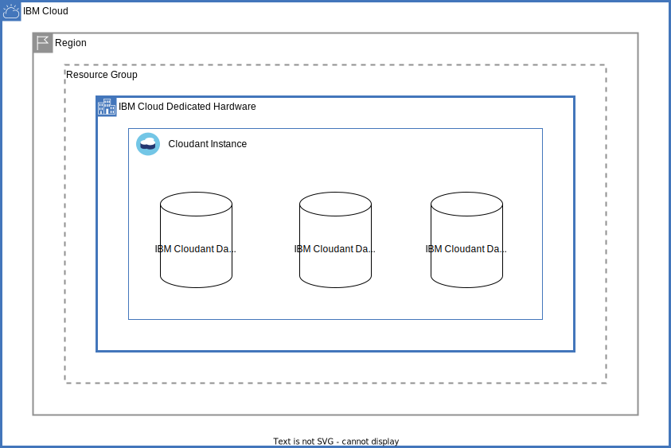

# IBM Cloudant Dedicated on IBM Cloud Dedicated

This architecture creates an IBM Cloudant Dedicated instance in IBM Cloud Dedicated and supports provisioning the following resources:

- A resource group, if one is not passed in.
- An IBM Cloudant Dedicated instance on IBM Cloud Dedicated
- A IBM Cloudant database

## Before you begin

* You need an IBM Cloudant [Dedicated Hardware plan instance](https://cloud.ibm.com/docs/Cloudant?topic=Cloudant-ibm-cloud-dedicated) for the IBM Cloudant instance.
